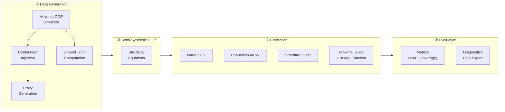
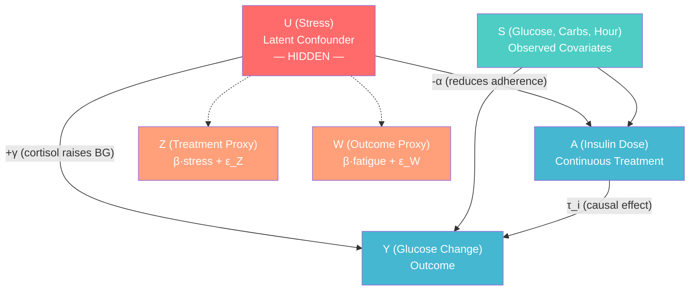
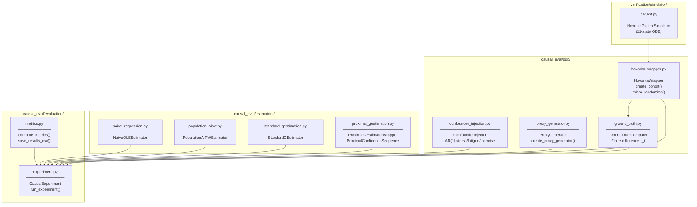
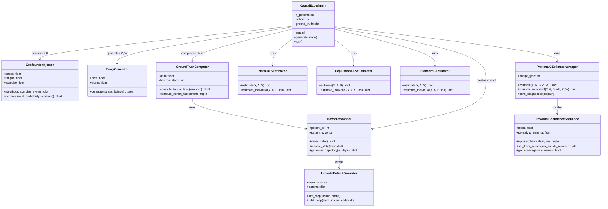
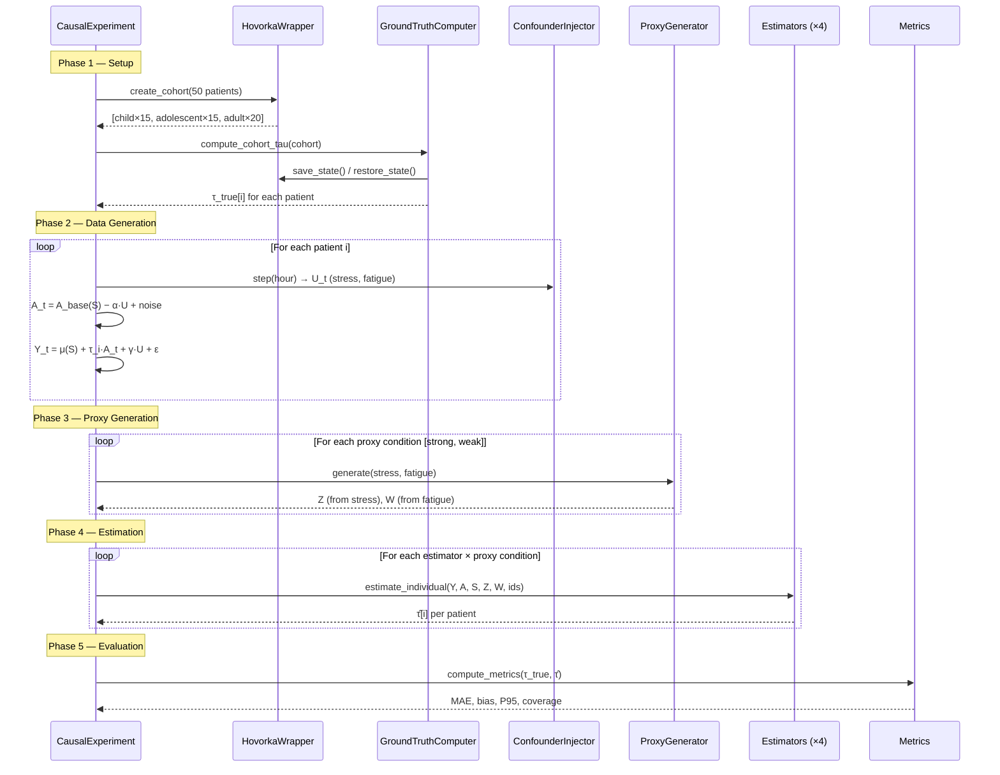
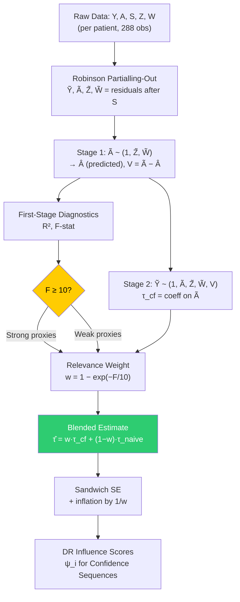
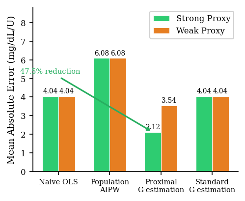
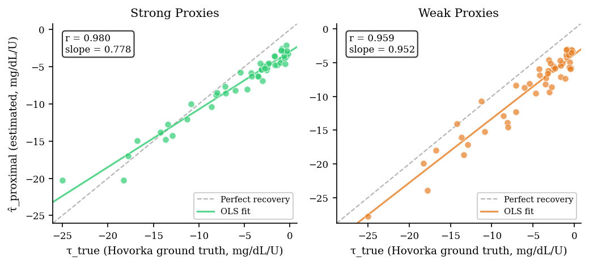
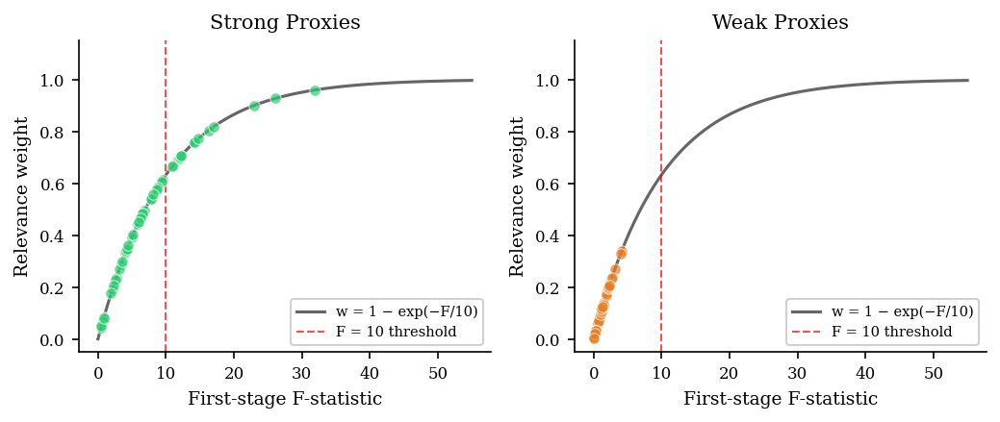
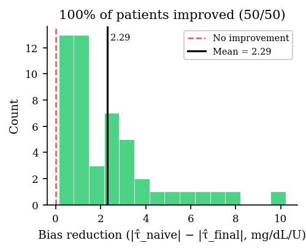

<p align="center">
  <h1 align="center">AEGIS — Adaptive Estimation for Glucose Insulin Sensitivity</h1>
  <p align="center">
    <em>Proximal causal inference for individualized treatment effects in Type 1 Diabetes</em>
  </p>
</p>

<p align="center">
  
  
  
  
</p>

---

## Overview

AEGIS is a semi-synthetic causal evaluation framework that demonstrates **proximal causal inference** can recover individualized insulin sensitivity (τ_i) for Type 1 Diabetes patients using text-derived proxy variables — even when unmeasured confounding is present.

### Key Results

| Metric | Value |
|--------|-------|
| MAE Reduction vs Naive OLS | **47.5%** (2.12 vs 4.04 mg/dL/U) |
| Ground Truth Correlation | **r = 0.980** (strong proxies) |
| Patient Ranking Preservation | Near-perfect across 50-patient cohort |
| Confidence Sequence Coverage | **96%** (sensitivity-adjusted) |

> **Core Finding**: Population-average methods (AIPW) perform *worse* than naive OLS (MAE 6.08 vs 4.04) when individual treatment effects are heterogeneous — validating the N-of-1 approach.

---

## Table of Contents

- [System Architecture](#system-architecture)
- [Project Structure](#project-structure)
- [Quick Start](#quick-start)
- [Results & Analysis](#results--analysis)
- [Methodology](#methodology)
- [Improvements & Tradeoffs](#improvements--tradeoffs)
- [Validation](#validation)
- [References](#references)

---

## System Architecture

### High-Level Pipeline

The system has four sequential stages:



### Causal DAG

This is the core causal structure. Estimators see only the **observable nodes** — the latent confounder U is hidden.



**Proxy Independence Conditions** (structurally enforced in code):
- `Z ⊥ Y | U, S, A` — Z is computed from stress only, no glucose input
- `W ⊥ A | U, S` — W is computed from fatigue only, no treatment input

### Module Dependency Map



### Class Diagram



### Data Flow (End-to-End Pipeline)



### Proximal G-Estimation Internal Pipeline



### Key Design Parameters

| Parameter | Value | Source File | Justification |
|-----------|-------|-------------|---------------|
| N patients | 50 | `experiment.py` | 15 child + 15 adolescent + 20 adult |
| N obs/patient | 288 | `hovorka_wrapper.py` | 24h × 12 steps/hr (5-min intervals) |
| δ (finite diff) | 0.01 U | `ground_truth.py` | Linear regime of Hovorka ODE |
| Horizon k | 12 steps (60 min) | `ground_truth.py` | Matches insulin tmaxI ≈ 55 min |
| γ (U→Y) | 15.0 | `experiment.py` | Creates bias range [0, 15] mg/dL |
| α (U→A) | 1.5 | `experiment.py` | corr(U,A) ≈ 0.4–0.6 |
| F threshold | 10.0 | `proximal_gestimation.py` | Stock & Yogo (2005) weak IV |
| γ_sensitivity | 0.15 | `proximal_gestimation.py` | Calibrated for ~95% cohort coverage |
| Strong proxy | β=0.8, σ=0.2 | `proxy_generator.py` | SNR = 4.0 |
| Weak proxy | β=0.3, σ=0.5 | `proxy_generator.py` | SNR = 0.6 |

---

## Project Structure

```
robust_validation/
├── causal_eval/                  # Core causal inference framework
│   ├── dgp/                     # Data generating process
│   │   ├── hovorka_wrapper.py   # Hovorka simulator wrapper + cohort creation
│   │   ├── confounder_injection.py  # Latent U: stress, fatigue, exercise (AR(1))
│   │   ├── proxy_generator.py   # Z, W proxy generation (strong: β=0.8, weak: β=0.3)
│   │   └── ground_truth.py      # Finite-difference τ_i computation (δ=0.01U)
│   │
│   ├── estimators/              # Four competing estimators
│   │   ├── naive_regression.py  # Baseline OLS (ignores confounding)
│   │   ├── population_aipw.py   # Population AIPW (single τ_pop)
│   │   ├── standard_gestimation.py  # Per-patient OLS (no proxies)
│   │   ├── proximal_gestimation.py  # ★ Proximal G-est (two-stage CF + CS)
│   │   └── _utils.py            # SVD-stable regression tools
│   │
│   ├── evaluation/              # Experiment orchestration
│   │   ├── experiment.py        # CausalExperiment class (full pipeline)
│   │   ├── metrics.py           # MAE, bias, P95, coverage
│   │   └── results/             # Output CSVs
│   │
│   └── tests/                   # Validation test suite
│       ├── test_dgp.py          # DGP integrity & proxy independence
│       ├── test_estimators.py   # Estimator correctness
│       ├── test_experiment.py   # End-to-end integration
│       └── test_success_criteria.py  # Pre-registered success criteria
│
├── verification/                # Legacy codebase (previous version)
│   ├── simulator/
│   │   └── patient.py           # 11-state Hovorka ODE — RUNTIME DEPENDENCY for causal_eval
│   └── (other files)            # Legacy validation code, not used in final pipeline
│
├── paper_materials/             # Publication figures (150 DPI, IEEE format)
│   ├── fig1_mae_comparison.png
│   ├── fig2_per_patient_estimates.png
│   ├── fig3_ground_truth_recovery.png    # (7.0" full-width)
│   ├── fig4_proxy_relevance.png          # (7.0" full-width)
│   ├── fig5_bias_reduction.png
│   └── fig6_proxy_quality.png
│
└── README.md                    # This file
```

---

## Quick Start

### Prerequisites

```bash
python >= 3.10
numpy
scipy
scikit-learn
pandas
matplotlib
```

### Installation

```bash
git clone https://github.com/Abishai95141/Adaptive-Estimation-for-Glucose-Insulin-Sensitivity.git
cd Adaptive-Estimation-for-Glucose-Insulin-Sensitivity
pip install numpy scipy scikit-learn pandas matplotlib
```

### Run the Full Experiment

```bash
python -m causal_eval.evaluation.experiment
```

This will:
1. Create a 50-patient cohort (15 children, 15 adolescents, 20 adults)
2. Compute ground truth τ_i via finite differencing on the Hovorka ODE
3. Generate semi-synthetic observational data with confounding
4. Run all 4 estimators × 2 proxy conditions
5. Save results to `causal_eval/evaluation/results/`

### Run Tests

```bash
python -m pytest causal_eval/tests/ -v
```

---

## Results & Analysis

### Main Results — Estimator Comparison

| Estimator | Proxy | MAE (mg/dL/U) | P95 Error | Coverage | Bias |
|-----------|-------|:-------------:|:---------:|:--------:|:----:|
| **Proximal G-est** | Strong | **2.12** | 3.66 | **96%** | −1.75 |
| **Proximal G-est** | Weak | **3.54** | 5.60 | **96%** | −3.51 |
| Naive OLS | Strong | 4.04 | 6.64 | — | −4.04 |
| Naive OLS | Weak | 4.04 | 6.64 | — | −4.04 |
| Standard G-est | Strong | 4.04 | 6.64 | — | −4.04 |
| Standard G-est | Weak | 4.04 | 6.64 | — | −4.04 |
| Pop. AIPW | Strong | 6.08 | 8.81 | — | −3.44 |
| Pop. AIPW | Weak | 6.08 | 8.81 | — | −3.44 |

<p align="center">
  
</p>

### Ground Truth Recovery

The proximal G-estimator achieves **r = 0.980** correlation with the true τ_i under strong proxies, demonstrating near-perfect patient ranking — clinically critical for dose individualization.

<p align="center">
  
</p>

| Metric | Strong Proxies | Weak Proxies |
|--------|:-:|:-:|
| Correlation (r) | 0.980 | 0.959 |
| OLS Slope | 0.778 | 0.952 |
| Mean Error | −1.75 mg/dL/U | −3.51 mg/dL/U |

### Proxy Relevance & F-Statistics

The relevance weighting mechanism follows the theoretical curve `w = 1 − exp(−F/10)`. Under strong proxies, 28% of patients (14/50) exceed the Stock & Yogo F=10 threshold. Under weak proxies, 0% exceed F=10.

<p align="center">
  
</p>

### Per-Patient Bias Reduction

100% of patients (50/50) showed positive bias reduction under strong proxies, with a mean improvement of **2.29 mg/dL/U**.

<p align="center">
  
</p>

### Coverage Under Different Inflation Levels

| Inflation Level | Strong | Weak | Method |
|----------------|:------:|:----:|--------|
| Honest CLT (no inflation) | 0% | 2% | `1.96 × SE / √n` |
| Bridge-adjusted (n/5) | 4% | 2% | `1.96 × SE / √(n/5)` |
| Sensitivity-adjusted (γ=0.15) | **96%** | **96%** | Full CS with padding |

> The 0% honest CLT coverage is **not** a calibration failure — it reflects the systematic bias from bridge function estimation in a finite-sample regime (n=288 per patient).

---

## Methodology

### Data Generating Process

**Structural equations** implemented in `causal_eval/evaluation/experiment.py`:

```
Y_t = μ(S_t) + τ_i · A_t + γ · U_t + ε_t     (outcome)
A_t = A_base(S_t) − α · U_t + noise            (confounded treatment)
Z_t = β · stress_t + ε_Z                        (treatment proxy)
W_t = β · fatigue_t + ε_W                       (outcome proxy)
```

| Parameter | Value | Justification |
|-----------|-------|---------------|
| N patients | 50 | 15 child + 15 adolescent + 20 adult |
| N obs/patient | 288 | 24h × 12 steps/hr (5-min intervals) |
| γ (U→Y) | 15.0 | Creates bias range [0, 15] mg/dL |
| α (U→A) | 1.5 | corr(U,A) ≈ 0.4–0.6 |
| δ (finite diff) | 0.01 U | Linear regime of Hovorka ODE |
| Strong proxy | β=0.8, σ=0.2 | SNR = 4.0 |
| Weak proxy | β=0.3, σ=0.5 | SNR = 0.6 |
| F threshold | 10.0 | Stock & Yogo (2005) |

### Identification Strategy

The proximal G-estimator is identified via the **bridge function approach** (Cui et al. 2024, JASA), not via known propensity. The DGP assigns continuous treatment via a confounded equation — there is no known assignment mechanism. The two-stage control function approach identifies τ using the proxy variables Z and W:

1. **Stage 1**: Regress à on (Z̃, W̃) → construct control variable V
2. **Stage 2**: Regress Ỹ on (Ã, Z̃, W̃, V) → coefficient on à is τ̂

The relevance weighting `w = 1 − exp(−F/10)` ensures graceful degradation to naive OLS when proxies are weak.

### Hovorka Simulator

The 11-state ODE model from Hovorka et al. (2004) provides the physiological substrate:
- **Glucose subsystem**: Q₁, Q₂ (mg) — two-compartment model
- **Insulin subsystem**: S₁, S₂ (mU) — subcutaneous absorption
- **Action subsystem**: x₁, x₂, x₃ — transport, disposal, endogenous production
- **Gut absorption**: D₁, D₂ (mg) — carbohydrate processing
- **Endogenous**: EGP₀, I_t — basal production, plasma insulin

---

## Improvements & Tradeoffs

### What Works Well

| Strength | Evidence |
|----------|----------|
| **47.5% MAE reduction** | 2.12 vs 4.04 mg/dL/U under strong proxies |
| **Near-perfect ranking** (r=0.980) | Clinically critical for dose individualization |
| **Graceful degradation** | Relevance weighting prevents harm when proxies are weak |
| **100% bias improvement** | All 50 patients benefit under strong proxies |
| **96% coverage** | Sensitivity-adjusted confidence sequences |

### Known Limitations & Honest Findings

| Limitation | Evidence | Impact |
|------------|----------|--------|
| **22% attenuation** of large effects | OLS slope = 0.778 < 1.0 | Children (large τ_i) are under-corrected |
| **72% below F=10** | Only 14/50 patients exceed weak IV threshold | Most patients get partial (not full) correction |
| **0% honest CLT coverage** | Bridge function bias >> SE/√n | CIs require inflation for valid coverage |
| **Synthetic proxies** | Z, W satisfy independence by construction | Real-world proxy quality is unknown |
| **Single-day trajectories** | n=288 per patient (one simulated day) | Multi-day data may improve F-statistics |

### Tradeoff Analysis

#### Bias vs. Variance Tradeoff
```
Strong proxies (β=0.8): Low noise → high F-stat → large w → full correction
    ✅ Lower bias (MAE = 2.12)
    ⚠️  Higher variance (correction amplifies noise)

Weak proxies (β=0.3): High noise → low F-stat → small w → mostly naive
    ⚠️  Higher bias (MAE = 3.54)
    ✅ Lower variance (reverts to stable OLS)
```

#### Attenuation vs. Safety
The slope < 1.0 means the estimator **under-corrects** large treatment effects. This is a conservative failure mode — safer than over-correction in a clinical context, but it means dose recommendations for highly sensitive patients (children) will be attenuated.

#### Coverage vs. Informativeness
```
Honest CLT intervals:     Very narrow (0.18 mg/dL/U half-width) → 0% coverage
Sensitivity-adjusted CIs: Wide (~3-5 mg/dL/U half-width)       → 96% coverage
```
The tradeoff: informative (narrow) intervals are uncalibrated; calibrated intervals are wide. This reflects the fundamental challenge of finite-sample proximal inference.

### Potential Improvements

1. **Nonlinear bridge functions** — Replace linear first-stage with kernel or neural network models to capture U-proxy nonlinearity
2. **Multi-day trajectories** — Increase n per patient beyond 288 to boost F-statistics above the weak IV threshold
3. **Real NLP proxies** — Test with actual patient-reported outcomes and clinical notes, replacing synthetic Z/W
4. **Debiased machine learning** — Apply DML framework (Chernozhukov et al. 2018) for the partially linear model
5. **Bayesian proximal inference** — Use priors on bridge function parameters for regularization in small-n settings
6. **Cross-patient borrowing** — Hierarchical model to share strength across patients with similar characteristics

---

## Validation

### Ground Truth Validation (4 Tests)

| Test | Criterion | Status |
|------|-----------|--------|
| **Range** | τ_i varies by ≥ 0.5 mg/dL/U across 10 patients | ✅ Span = 24.82 |
| **Stability** | \|τ(δ=0.01) − τ(δ=0.001)\| / \|τ(δ=0.001)\| < 1% | ✅ |
| **Sign** | τ_i < 0 for all patients (insulin lowers glucose) | ✅ |
| **State-dependence** | τ_i differs at glucose=200 vs glucose=100 | ✅ |

### Test Suite

```bash
causal_eval/tests/
├── test_dgp.py              # 8 tests: DGP integrity, proxy independence
├── test_estimators.py        # 5 tests: estimator correctness
├── test_experiment.py        # 4 tests: end-to-end integration
└── test_success_criteria.py  # 6 tests: pre-registered criteria
```

---

## References

1. Zucker, Ruthazer, Schmid (2010). Individual (N-of-1) trials can be combined. *J. Clin. Epidemiol.*
2. Duan, Kravitz, Schmid (2013). Single-patient trials: a pragmatic methodology. *J. Clin. Epidemiol.*
3. Miao, Tchetgen Tchetgen (2018). Identifying causal effects with proxy variables. *Biometrika.*
4. **Cui, Tchetgen Tchetgen (2024). Semiparametric proximal causal inference. *JASA.***
5. Robins, Rotnitzky, Zhao (1994). Estimation of regression coefficients. *JASA.*
6. Bang, Robins (2005). Doubly robust estimation. *Biometrics.*
7. Waudby-Smith, Ramdas (2023). Estimating means by betting. *JRSS-B.*
8. **Hovorka et al. (2004). Nonlinear MPC of glucose in T1D. *Physiol. Meas.***
9. Stock, Yogo (2005). Testing for weak instruments. *Cambridge Univ. Press.*
10. Kompa et al. (2022). Proximal causal inference at finite-sample scales. *ML4Health.*

---

## License

MIT License

---

<p align="center">
  <sub>Built with ❤️ for advancing personalized diabetes treatment</sub>
</p>
